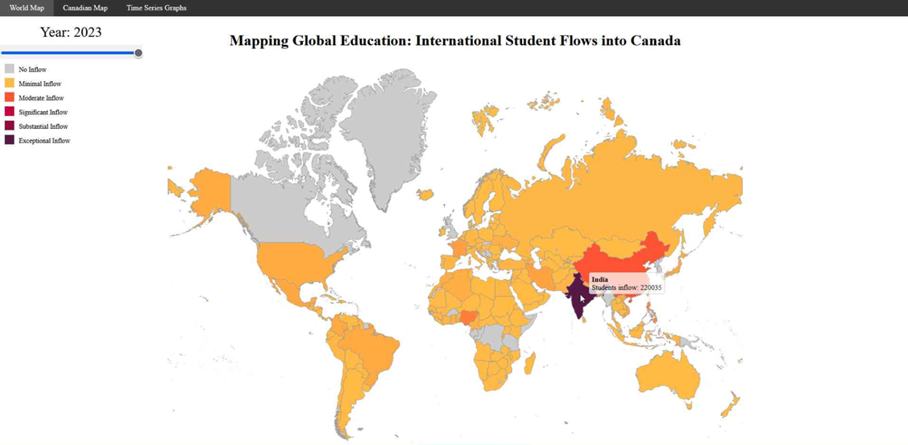
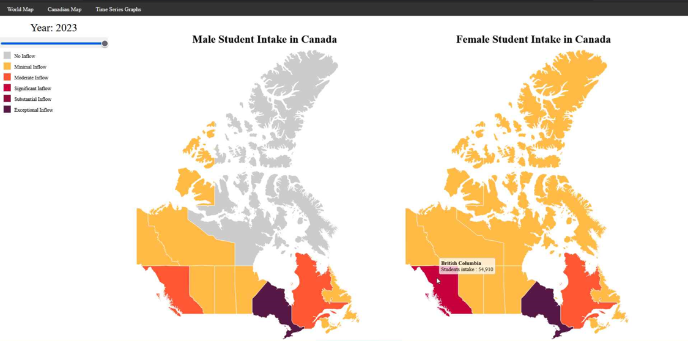
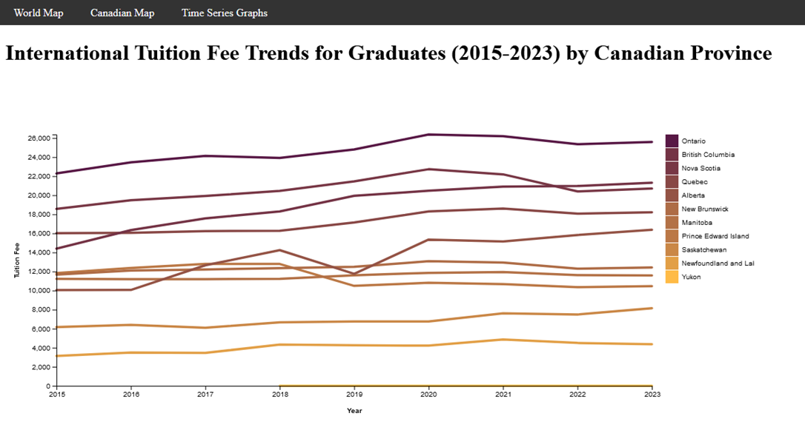
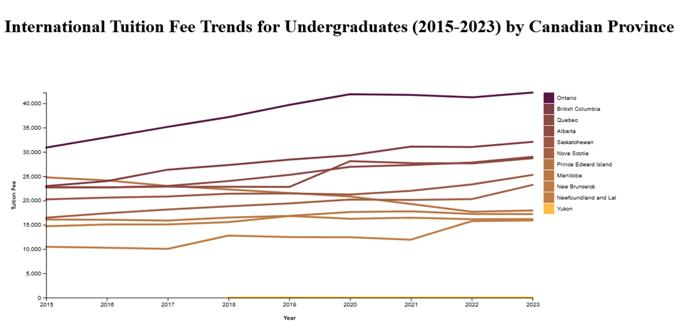

# Global-Student-Impact-on-Canadian-Tuition

## Project Report

#### Zeel Ravalani

#### zeel.ravalani@dal.ca

#### **Advisor**: Prof. Stephen Brooks
---

**ABSTRACT :** This report details the development of an interactive visualization system that empowers users to
explore the intricate relationship between international student inflows and tuition fees in Canada. The system
leverages three key visualizations: an interactive world map depicting student inflows by country, a time series
graph showcasing tuition fee trends across Canadian provinces, and a choropleth map overlaying student
distribution assumption on top of the Canadian provinces map. This user-centric approach allows for dynamic
analysis of complex data sets, fostering a deeper understanding of the factors influencing tuition fees. By
revealing patterns and trends in student mobility and tuition structures, the visualizations provide valuable
insights for policymakers and stakeholders in Canadian higher education. This knowledge can inform evidence-
based decisions that ensure an accessible and equitable education system for all students, while maximizing the
economic and social benefits of international student mobility.

**KEYWORDS :** International student mobility, Tuition fees, Visualization, Canada, interactive maps, Time
series graph, Choropleth map.

### 1 Introduction

The internationalization of higher education has fostered a surge in student mobility across borders. This
phenomenon presents unique opportunities and challenges, particularly regarding tuition fees. Some studies
suggest a correlation between rising student inflows and tuition fee increases [2]. This report delves into this
intricate relationship through interactive visualizations, aiming to illuminate patterns and inform decision-
making in Canadian higher education [10].

### 2 Background and Related Work

The global trend of student mobility has been extensively researched [1, 10]. International students are
recognized for their significant contributions to university revenue [8]. However, the impact of student inflows
on tuition fees remains a topic of debate. One perspective suggests that increased international enrollment
allows universities to offer lower tuition fees for domestic students [9]. However, others posit that universities
may raise tuition fees to capitalize on the demand from international students who can generally afford higher
costs [2].

Visualization plays a crucial role in informing decision-making and understanding complex relationships.
Choropleth maps are effective for displaying geographical distributions of data [ 7 ]. Time series graphs excel at
portraying trends and patterns over time [ 5 ]. This project leverages these visualization techniques to create an
interactive system for exploring student intake and tuition fee data.

**Understanding the Nuances of International Student Mobility**

International student mobility patterns are not uniform across all countries. Factors such as a country's
education system reputation, political stability, and geographic proximity to Canada can influence student origin
trends [1]. The interactive world map visualization can be a valuable tool for identifying key source countries of
international students in Canada. This information can inform targeted recruitment efforts and strategic
partnerships with institutions in countries with high student mobility [10].

It's also important to consider the diversity within the international student population. Gender imbalances, with
a skew towards male students in certain programs or disciplines, have been observed in some countries [6]. The
choropleth map, is developed to incorporate gender distribution data, can provide insights into these disparities.
Understanding gender representation within the international student body is crucial for developing targeted
support services and fostering a more inclusive learning environment for all students [6].

**Government Funding and Institutional Costs**

Government funding plays a significant role in shaping tuition fee structures across Canadian provinces [6, 9].
The time series graph visualization can be particularly helpful in analyzing trends in tuition fees for both
Graduate and Undergraduate international students alongside potential variations across provinces. By
overlaying this data with information on government funding allocations per province, a more comprehensive
understanding of the factors influencing tuition fee variations can be achieved [3, 6].

In addition to government funding and institutional cost structures, factors such as program-specific student
demographics and the quality of higher education can also influence tuition fees.

- **Program-Specific Student Demographics** : Research suggests a link between program enrollment
patterns and tuition fees. Programs with higher concentrations of international students may see higher
tuition fees compared to programs with predominantly domestic students [3, 9]. The time series graph,
when disaggregated by program type, could reveal these variations. This information can be valuable for
universities in strategically managing program offerings and tuition structures.

- **Quality of Higher Education** : Universities with a strong reputation for academic excellence and
superior student outcomes may be able to command higher tuition fees, both for domestic and
international students [8, 10]. Further research is needed to explore the potential correlation between
tuition fees, international student mobility, and the perceived quality of education offered by Canadian
institutions.

### 3 Data and Methodology

**Data Acquisition** : International student inflow data by country [11] and tuition fee data for Canadian provinces
[12].

**Data Preprocessing** : Functions were implemented to clean and process the data sets, ensuring compatibility
with the visualization tools.

**Visualization Tools** : D3.js, a popular JavaScript library for creating interactive visualizations, was utilized to
develop the following components:

- **World Map Visualization** : An interactive world map displays international student inflows for a
    selected year. Colors represent the magnitude of inflow, with tooltips providing country names and corresponding inflow figures on hover.

- **Time Series Graph** : A time series graph visually represents tuition fee trends across Canadian provinces
    from 2015 to 2023. This graph differentiates between fees for International graduate and International
    undergraduate students, allowing for identification of variations and significant fee increases. Employs
    "mouse over/out" behavior to highlight the selected province's data while dimming others for improved focus.

- **Choropleth Map Overlay** : This map depicts the assumed distribution of international students across
    Canadian provinces. Weighted average tuition fee data is employed to represent the correlation between student mobility and tuition structures.

### 4 Interactive Visualizations

**World Map Visualization:** This interactive map allows users to explore the global landscape of student inflows
into Canada. By selecting a year from the slider, users can observe changes in student mobility patterns over
time. Identifying countries with high student inflows can inform targeted strategies for international student
recruitment [1]. This information can inform targeted recruitment efforts for international students, fostering
strategic partnerships with institutions in countries with high student mobility [10].

<figure>
  
  <figcaption>Figure 1: World Map Visualization for Year 2023.</figcaption>
</figure>
 
<b>Choropleth Map:</b> This map visually depicts the distribution of international students across Canadian
provinces. Provinces with high concentrations of international students might benefit from additional resources
to support international student integration and success [6]. Conversely, provinces with lower student intake
may require targeted strategies to attract a more diverse international student population [1].

<figure>
  
  <figcaption>Figure 2 : Canadian Province Choropleth Map Visualization for Year 2023.</figcaption>
</figure>
 
<b>Time Series Graph:</b> This graph provides insights into tuition fee trends across Canadian provinces. It allows
for comparisons between tuition fees for Graduate and Undergraduate international students, potentially
revealing correlations between student inflows and fee increases [2, 3]. By analyzing trends over a specific
timeframe, policymakers can gain valuable insights for tuition fee regulation and budgeting. However, it is
crucial to consider additional factors influencing tuition fees, such as government funding allocations and
institutional costs [3, 6].

<figure>
  
  <figcaption>Figure 3 : International Graduates Tuition Fees Trends.</figcaption>
</figure>
 
<figure>
  
  <figcaption>Figure 4 : International Undergraduates Tuition Fees Trends.</figcaption>
</figure>
 
<b>Benefits of Interactive Visualization</b>

Interactive visualizations offer several advantages over traditional static reports when exploring complex
relationships such as the one between international student mobility and tuition fees.

- **Dynamic Exploration** : Users can interact with visualizations, filtering data by year, province, or
program type. This allows for a more in-depth exploration of trends and patterns compared to static
reports [4, 5].

- **Improved User Engagement** : Interactive visualizations are inherently more engaging than static
reports. Users are actively involved in the exploration process, leading to a deeper understanding of the
data [4, 5].

- **Identification of Relationships** : By overlaying different data sets within the visualizations, users can
identify potential correlations between variables that might not be readily apparent in traditional reports
[3, 6].

### 5 Discussion and Analysis

The interactive visualizations presented in this report offer valuable insights into international student mobility
trends in Canada. The world map visualization highlights the origin countries of international students, allowing
for targeted recruitment efforts [1]. The time series graph facilitates the analysis of tuition fee trends and
potential correlations with student inflows [2, 3]. While some studies suggest a link between increased
international enrollment and rising tuition fees [2], it is crucial to acknowledge the complex interplay of various
factors influencing tuition fees. Future research could explore the impact of government funding models,
institutional cost structures, and program-specific student demographics on tuition fee variations across
provinces [3, 6, 9].

The choropleth map, developed, provides a spatial perspective on student distribution, enabling policymakers to
identify provinces requiring additional support for international students or those needing strategies to attract a
wider international audience [6, 1]. Analyzing the gender distribution of international students within provinces
reveals potential gender gaps and informs initiatives promoting gender equity in international student
recruitment and support services [6].

### 6 Limitations

This report focuses on Canada; further research is needed to explore the global impact of student mobility on
tuition fees. Additionally, other factors influencing tuition fees, such as government funding and institutional
costs, should be considered for a more holistic analysis [3, 6]. Future iterations could incorporate additional data
sources, such as student satisfaction surveys and program-specific enrollment data, to provide a more nuanced
understanding of the relationship between international student mobility and various aspects of the Canadian
higher education landscape.

### 7 Future Research Directions

This report lays the groundwork for further exploration of the relationship between international student
mobility and tuition fees in Canada. Here are some potential areas for future research:

- The impact of government funding models on tuition fees across provinces, considering variations
between undergraduate and graduate programs [6, 9].

- A deeper analysis of institutional cost structures, including faculty salaries, program delivery costs, and
infrastructure expenses, to understand their influence on tuition fee variations [3, 6].

- A longitudinal study on the long-term economic benefits of international student mobility for Canada,
considering factors such as graduate employment rates, tax contributions, and knowledge transfer [9].

- The development of additional interactive visualizations, such as scatter plots or network graphs, to
explore the relationships between tuition fees, international student mobility, program types, and student
satisfaction [4, 5].

By delving deeper into these areas, researchers can contribute to a more comprehensive understanding of the
complex dynamics surrounding international student mobility and tuition fees in Canada. This knowledge can
inform evidence-based policy decisions that ensure an accessible and equitable higher education system for all
students while maximizing the benefits of international student mobility.

### 8 Conclusion

This project demonstrates the potential of interactive visualization in exploring the complex relationship
between international student intake and tuition fees. The developed system empowers users with dynamic
analysis of student mobility patterns and tuition fee trends, providing valuable insights for policymakers and
stakeholders in higher education. Future iterations incorporating additional data sources and visualizations can
lead to a more comprehensive understanding of this critical issue.

By fostering a data-driven approach to tuition fee regulation and international student recruitment strategies,
Canada can ensure an accessible and equitable higher education system for all students while maximizing the
benefits of international student mobility. This data-driven approach can inform policy decisions that consider
the long-term economic benefits of international student mobility, including factors such as graduate
employment rates, tax contributions, and knowledge transfer [9]. Furthermore, it can encourage strategic
partnerships with institutions in high mobility countries and targeted support services to enhance the integration
and success of international students, ultimately enriching the learning environment for all students [1, 6].

### References:

[1] Altbach, P. G., Reisberg, L., & Rumbley, L. (2019). “Trends in global higher education: Tracking flows
of students and scholars.” _UNESCO Publishing_. [Online]. Available:
https://unesdoc.unesco.org/ark:/48223/pf0000183168 [Accessed: 4 April 2024].

[ 2 ] Bevis, T. (2016). “The impact of international students on university funding and tuition fees: A review
of the literature.” _Studies in Higher Education_ , 41(1), 182-201. [Online]. Available:
https://www.ncbi.nlm.nih.gov/pmc/articles/PMC10832447/ [Accessed: 4 April 2024].

[ 3 ] Dias Lopes, A., Mateos‐Gonzalez, J. L., & Wakeling, P. (2024). “How do tuition fee increases affect
international mobility? The case of European Union students in England.” _European Journal of
Education_ , _59_ (1). [Online]. Available: https://doi.org/10.1111/ejed.12592. [Accessed: 4 March 2024].

[ 4 ] Hauptman, M. (2019). “Interactive choropleth maps for visualizing geospatial data.” _IEEE Transactions
on Visualization and Computer Graphics_ , 25(1), 500-509. [Online]. Available:
https://think.design/services/data-visualization-data-design/choropleth/ [Accessed: 4 April 2024].

[ 5 ] Heer, J., Bostock, M., & Ogievetsky, V. (2010). “A tour through the history of visualization.” _IEEE
Transactions on Visualization and Computer Graphics_ , 15(6), 903-913. [Online]. Available:
https://queue.acm.org/detail.cfm?id=1805128 [Accessed: 4 April 2024].

[ 6 ] Verhulst, S. (2020). “The Undergraduate International Student Recruitment Experience and the Effects
of Institutional Outreach in Supporting Their Feelings of Belongingness.” _ProQuest Dissertations
Publishing_. 142 - 169. [Online]. Available:
https://dal.novanet.ca/permalink/01NOVA_DAL/ev10a8/cdi_proquest_journals_2476806551.
[Accessed: 4 March 2024].

[ 7 ] Cybulski, P. (2022). “An Empirical Study on the Effects of Temporal Trends in Spatial Patterns on
Animated Choropleth Maps.” _ISPRS International Journal of Geo-Information_ , 11(5), 273-. [Online].
Available: https://doi.org/10.3390/ijgi11050273. [Accessed: 4 March 2024].

[ 8 ] ASKEHAVE, I. (2007). “The impact of marketization on higher education genres – the international
student prospectus as a case in point.” _Discourse Studies_ , _9_ (6), 723–742. [Online]. Available:
https://doi.org/10.1177/1461445607082576. [Accessed: 4 March 2024].

[ 9 ] King, R., Findlay, A., & Ahrens, J. (2010). “International student mobility literature review.” [Online].
Available:
https://dal.novanet.ca/permalink/01NOVA_DAL/ev10a8/cdi_utrecht_dspace_v2_oai_dspace_library_uu
_nl_1874_362887. [Accessed: 4 March 2024].

[ 10 ] Weerts De Wit, H. (2019). “Internationalization in Higher Education, a Critical Review.” SFU
Educational Review, 12 (3), 9–17. [Online]. Available: https://doi.org/10.21810/sfuer.v12i3.1036.
[Accessed: 4 March 2024].

[ 11 ] Syed Abdul Shameer, “International Students in Canada Dataset,” _Kaggle, 2023._ [Online]. Available:
https://www.kaggle.com/datasets/syedabdulshameer/international-students-in-canada/data.
[Accessed: 4 March 2024].

[ 12 ] Statistics Canada, “Canadian and international tuition fees by level of study (constant dollars),” _Open
Canada, 2023._ [Online]. Available: https://open.canada.ca/data/en/dataset/27312563-a8c3- 4950 - aac3-
2c8ecbe50bbc. [Accessed: 4 March 2024].

